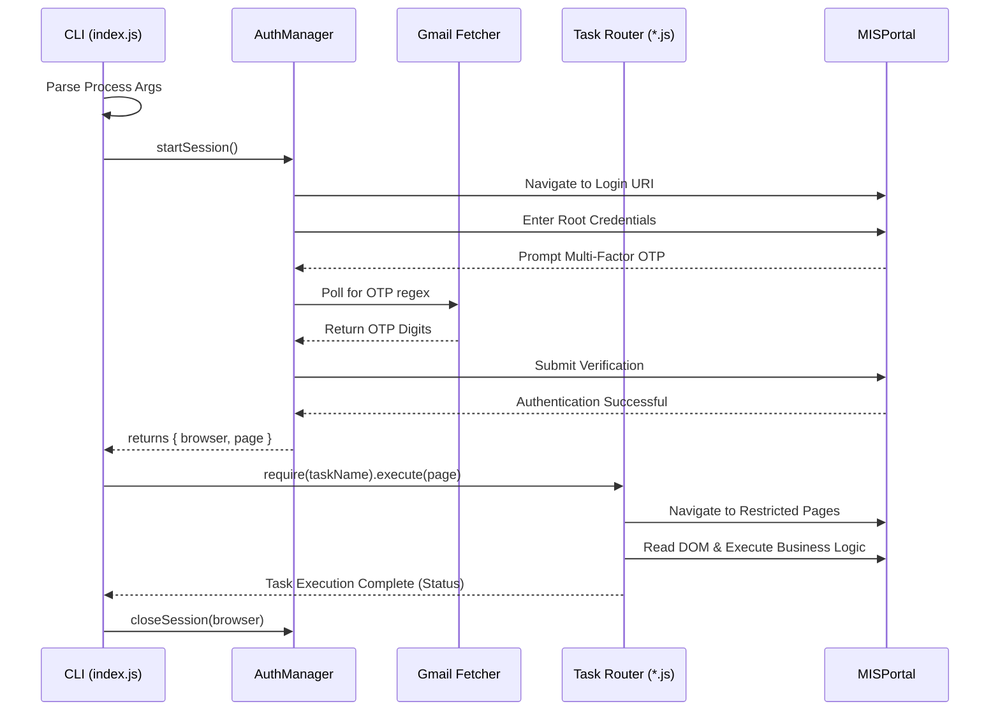

# Architecture: Pluggable Automation Script

## Overview
A modular Node.js automation framework using Puppeteer for web automation and Gmail API (IMAP) fetching for OTPs. The core architecture separates the authenticating phase (base layer) from the execution of specific automated jobs (like filling attendance). These specific jobs are exposed as independent tasks that can be triggered incrementally via Terminal CLI commands.

## Core Components
### 1. CLI Entry Point (`src/index.js`)
Acts as the central router and orchestrator.
- **Function**: Parses command-line arguments to determine which exact task the user wants to run (e.g., `node src/index.js fill-attendance`).
- **Flow**: It initializes the Puppeteer browser instance, invokes the authentication flow (`auth.js`), hands the secure, authenticated `page` object to the requested task module, and ensures safe teardown of all browser resources upon completion or failure.

### 2. Authentication Flow (`src/auth.js`)
Provides a robust, reusable method to log into the MIS portal.
- **Function**: Abstraction of the complex, fragile login flow.
- **Flow**: Handles inputting user credentials, detecting if the MIS portal is asking for OTP verification, waiting/requesting the OTP from the Gmail module, and successfully bypassing multi-factor authentication. 
- **Return**: Yields the authenticated Puppeteer `page` and `browser` objects back to the orchestrator.

### 3. Gmail OTP Fetcher (`src/gmail.js`)
Headless service script integrating with the user's Inbox.
- **Function**: Connects to Gmail via IMAP App Passwords and polls for new incoming unread messages dispatched from the MIS portal.
- **Flow**: Extracts the body of emails, searches for the OTP using Regular Expressions, marks the email as read securely, and returns the strictly numerical PIN to the `auth.js` module.

### 4. Browser Wrapper (`src/browser.js`)
Underlying Puppeteer configurator.
- **Function**: Wraps the Puppeteer `Browser` and `Page` concepts, managing the Chromium lifecycle, viewport size, caching, and custom navigation configurations. Useful for toggling between headless/headful testing environments.

### 5. Task Modules (`src/tasks/*.js`)
Independent modules mapping highly specific business logic.
- **Current Task:** `src/tasks/fillAttendance.js`
- **Function**: Contains the domain logic strictly required for the specified parameter. For attendance, it navigates to the timetable, checks for dynamically generated pending slots, maps dropdowns uniquely (planning, planning status, learning domain), skips locked students, recursively fills attendance lists, and saves.
- **Extensibility**: To add completely new abilities (like "scraping grades" or "downloading syllabus"), simply write a new script in `src/tasks/myNewJob.js` that exports an `execute(page)` function, and map it in the Switch-Case statement inside `src/index.js`.

### 6. Data Provider (`src/csvReader.js`)
Utility script for external static data ingestion.
- **Function**: Steams a local `.csv` file (using the `csv-parser` dependency) to make structured flat-file data directly available as JSON arrays for task manipulation logic.

## Execution Sequence (Sequence Diagram)

## Security & Maintenance Considerations
- **Environment Variables**: Sensitive components (such as `EMAIL_USER`, `EMAIL_PASS`, `PORTAL_USER`, `PORTAL_PASS`) rely on `.env` files. Ensure `.env` is strongly `.gitignore`d.
- **Session Continuity**: Ensure Page navigations inside isolated Task Scripts do not forcefully clear browser cookies securely acquired during the primary Authentication phase.
- **Element Fragility**: The Parul University MIS portal relies on dynamically generated ASP.Net DOM nodes. Tasks frequently utilize XPaths or CSS attribute selectors mapped precisely to `class` names or text strings. If structural UI changes occur on the server side, relevant CSS/XPath selectors inside specific `src/tasks/` will need reflowing.
